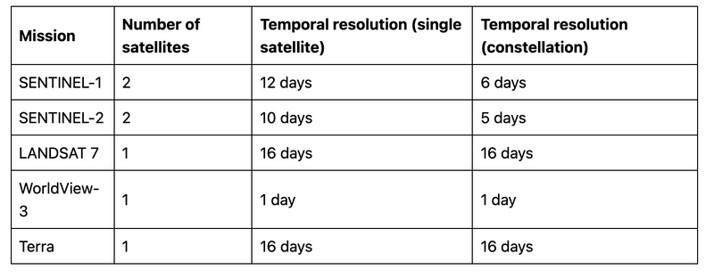

# Raster

## Resolution

What is resolution of a satellite image? How can we understand it? Generally speaking we can say there are **three** different resolutions for a satellite image in Geoscience.\

### **Spatial resolution**

Spatial resolution is the detail in pixels of an image. High spatial resolution means more detail and a smaller grid cell size. Whereas, lower spatial resolution means less detail and larger pixel size. Overall, spatial resolution describes the quality of an image and how detailed objects are in an image. If the grid cells are smaller, this means the spatial resolution has more detail with more pixels.

### **Temporal resolution**

Same definition of temporal resolution can be applied to polar orbiting satellites. But defining it more precisely, temporal resolution for a polar orbiting satellite is the amount of time that the satellite takes to revisit and recapture a particular site. It is also commonly referred to as a satellite’s revisit period.

### **Spectral resolution**\

Spectral resolution is determined by the width of each band in a wavelength. The more bands in an image, the more complex the color will be.

\

## CRS
>

A Coordinate reference system (CRS) defines, with the help of coordinates, how the two-dimensional, projected map is related to real locations on the earth. There are two different types of coordinate reference systems: **`Geographic Coordinate Systems`** and **`Projected Coordinate Systems`**.

> --- Qgis Documents

## Manipulation in R

How can we manipulate remote sensing imagery in R after we have a general understanding of raster data? Here I want to introduce to you a package: `terra`, which is a tweaked version or even a more powerful package than the well-known one: `raster`. As for the reason why the author choose to rebuild some functions, you can check it [here](http://www.wvview.org/os_sa/15_Raster_Analysis_terra.html).

## Reference
- http://modern-rstats.eu/index.html#note-to-the-reader
